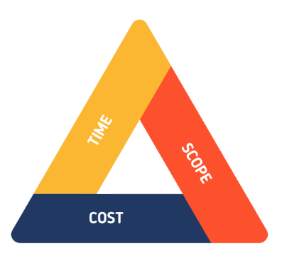

*`Jean Burgos PMP®`*

In this area I will describe some of the projects conducted as a 1SG.

# Projects

# Trainee Reception
  - Initiating
  - Planning
  - Executing
  - Monitoring and Controling

# Barracks room coordination and maintenance/ - Room, furniture and facility maintenace 
  - Initiating
  - Planning
  - Executing
  - Monitoring and Controling

# Physical Fitness Training program
  - Initiating
  - Planning
  - Executing
  - Monitoring and Controling

# Academic enrollment for three shifts
  - Initiating
  - Planning
  - Executing
  - Monitoring and Controling

- School Transportation
# Program of Instruction Coordination and execution
  - Initiating
  - Planning
  - Executing
  - Monitoring and Controling

- Meeting with executives to provide status and progress report

# Graduation coordination
  - Initiating
  - Planning
  - Executing
  - Monitoring and Controling

# Administrative management

### Other Projects
- [Command Post Field Communications Infrastructure Project](/projects)
- [Basic Combat Training Projects](/project2)
- [Satellite Technicians Course Project](/project3)
- [Deployable Communications Infrastructure](/project4)