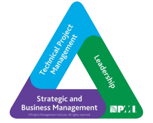
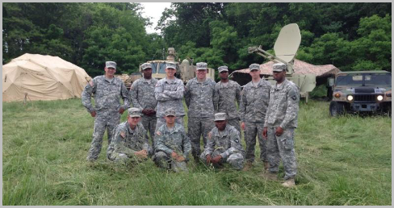
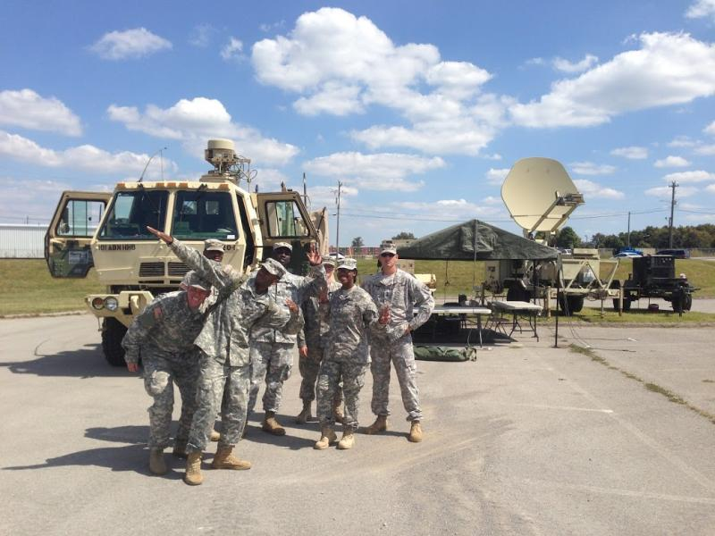

*`Jean Burgos PMP®`*

#### In this article, I take a look at what areas of this assignment are similar and relevant to project mangement. 

A [Signal Platoon Sergeant (Project Manager)](../blog/images.md) leads a group of 30 to 60 technical soldiers with various specialties, including network engineering, installation team, satellite transmissions, radio backbone transmissions, and system engineers. 

The primary goal of this team is to provide deployable voice, data, and video communications to the Division Commander and the executive staff in the area of responsibility. 

# Initiating
- The Signal Platoon Sergeant (Project Manager) meets with company executives and the communications directorate to receive project purpose, requirements, and instructions. 
- Stakeholders are identified. 
- Identifying requirements
  - How many users (~200)
  - How many specialty systems (many)
  - How many computers
  - How many VoIP
  - How many IP networks (Classified and Unclassified)
  - How many radio networks (Tacsat, FM, HF)
# Planning
- Together with the team, develop a project management plan for execution. 
- Request satellite access and frequency allocations. 
- Set up communication systems for testing before execution.
- Define scope- The scope is embedded in our primary mission.
- Develop a site layout and a system diagram to communicate requirements with the installation team.  
- Create a Work Breakdown Schedule that will be used for execution by every team
- Develop and maintain standard operating procedures to increase efficiency and proficiency
- Develop and communicate the project schedule
- Plan transportation, fuel, meal, and system access resources
- Develop a risk management strategy
- Engage stakeholders to provide feedback and project status
- Communicate the concept of operations to internal and external teams
- Rehearse the execution plan.
# Executing
- Direct and manage the execution of the project plan to meet project timelines and milestones. 
- Identify lessons learned during the execution in regard to efficiency, quality, and safety. 
- Acquire resources and ongoing needs such as fuel, meals, and system access.
- Conduct daily stand-up meetings to discuss work done and issues during the last 12 hours, next 12, and any issues or blockers to establish network systems or user access. 
- Implement risk responses.
- Engage stakeholders to provide feedback and project status
# Monitoring and Controlling
- Monitor and control project work to ensure efforts meet the project plan. 
- Validate system diagram and actual installation using feedback to change or address the installation to control scope and quality while meeting customer's needs.
- Monitor communications with stakeholders, executives, and communications directory.
- Monitor risk and implementation of the risk mitigation plan.
- Provide system support throughout the duration of the project to ensure every customer has access to the necessary digital resources.
# Closing
- Meet with executives to identify the end-of-system needs. (Acceptance)
- Communicate with the team the sequence of events on bringing systems down for redeployment.
- Conduct after-action reviews to collect feedback on what went well and areas of improvement for future projects. 
- Coordinate logistics to return vehicles, equipment, and personnel to the home station.

