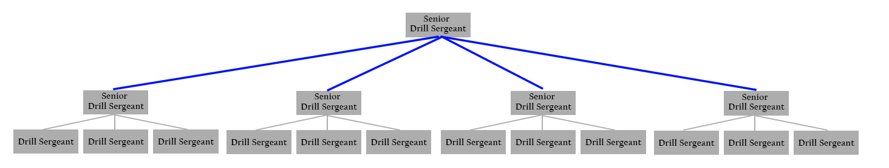

*`Jean Burgos PMP®`*
.JPG)
# Drill-Sergeant

The Basic Combat Training staff resembles a Projectize Organizational Structure.
# Duty Description
The Senior Drill Sergeant (Senior Project/ Program Manager) in a Basic Combat Training Company conducts training for at least 60 to 220 Initial Entry Soldiers in a 10-week cycle. The Senior Drill Sergeant is responsible for the accountability, professional development, supervision, and evaluation of three Drill Sergeants (Project Managers) under his charge and mentors nine other junior Drill Sergeants from separate groups.

# Initiating
- **Develop a Project Charter**- Identify all Drill Sergeants (Project Managers), and track each license and certification to ensure they are valid. 
- **Identify the business need**/ Why is the project necessary- Basic training is a requirement for every soldier. Without this type of project, trainees could not become soldiers, and the Army would not have a labor force.
- **Identify Stakeholders**- in this case, our trainees are our "product" as well as our stakeholders
# Planning
- **Define Project Scope**- to assist each individual to become a soldier, meeting all basic standards in no more than ten weeks.
- **Collect Requirements**- Use the Program of Instruction to identify and track each training requirement. 
- **Plan Resources Management**- This is done ahead of time by forecasting resources that cannot be wasted.
- **Develop Schedule**- Put together a comprehensive schedule with dates, times, locations, training, and personnel.
- **Create a Work Breakdown Structure** for each training task following the doctrine that will be used by all Drill Sergeants (Project Managers)
- **Plan Risk Management**- Generate a risk assessment for every training event. Follow up daily to mitigate risk. Report all incidents and accidents to personnel immediately. 

- Forecasts, coordinates, plan, and submit land reservation six weeks out from the day of execution to access training areas to conduct training
- Forecasts, coordinates, plan, and submit ammunition request six weeks for 220 trainees during practice and qualifications during assigned range weeks
- Forecast, coordinates, plan and submit transportation request for 220 trainees during a 10-week cycle
- Forecast, coordinate, plan and request meals for 220 trainees during a 10-week cycle
- Generates student/ trainee rosters to maintain accountability
- Conducts EPA analysis of training areas to ensure environmental compliance
- Conducts and analyses risk assessment for every training event using a risk management framework to generate, implement and supervise risk-mitigating strategies successfully
# Executing
- **Direct and Manage Project Work**- Monitor the execution of the training plan according to the prepared plan and doctrine. 
- **Manage Quality**- Monitor training to ensure standards are met safely and on time. 
- **Aquire Resources**- Coordinate and follow up with transportation, ammunition, meals, land, and other external agencies.
- **Manage and develop team**- Train and develop each Drill Sergeant (Project Manager) to ensure they master the tasks they will teach. Ensure proper training certifications are valid—schedule certification training as needed. 
- **Manage Communications**- Communicate the project plan to executives, project managers, and trainees. 
- **Implement Risk response**- Monitor and control the implementation of risk response. Report risk residual if above medium. 
- **Conduct Procurements**- Coordinate with external agencies to ensure resources are delivered on time.
- **Manage Stakeholders**- Communicate consistently with internal and external stakeholders. Prepare progress reports for executives. 

# Monitoring and Controlling
- **Monitor Risk**- Monitor and control the implementation of risk response. Report risk residual if above medium.
- **Control Resources**- Ensure that only the forecasted resources are used. 
- **Monitor and control project work**- Monitor execution of the plan.
- **Control scope**- Ensure work is being done to meet the scope and avoid gold plating.

# Closing
- Provide task completion report.
- Report program failures and provide a remediation plan. 
- Coordinate the offboarding of trainees.
- Coordinate transportation and logistic support for trainees' travel to their first duty assignment.
- Reset facilities in preparation for future projects.

  
