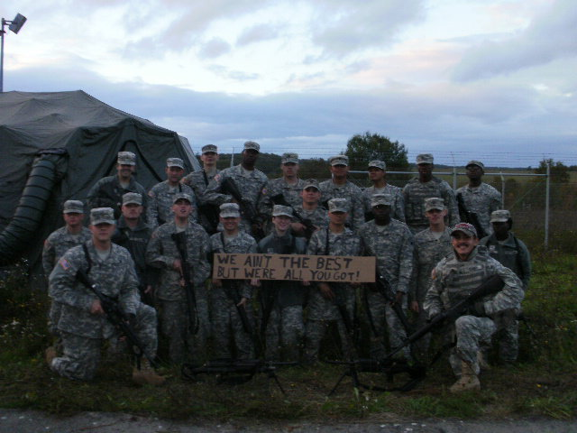
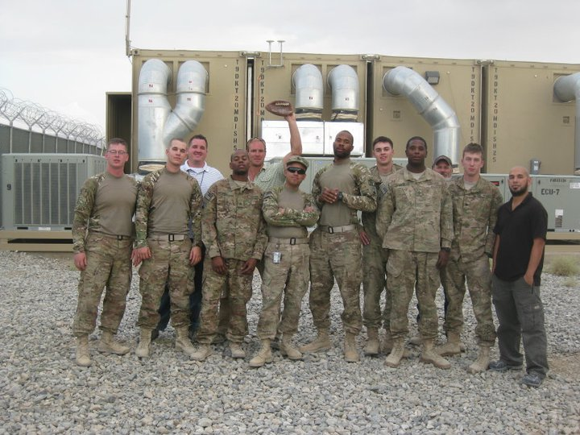
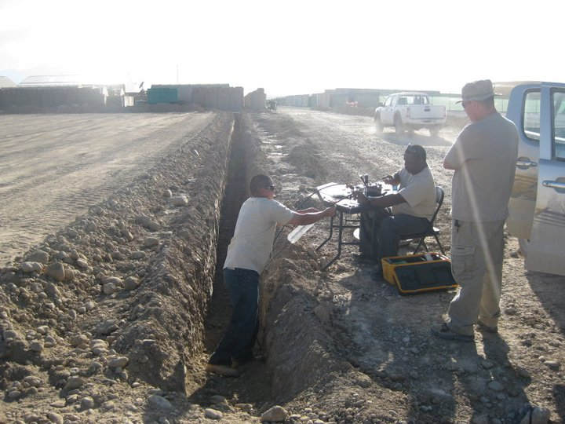
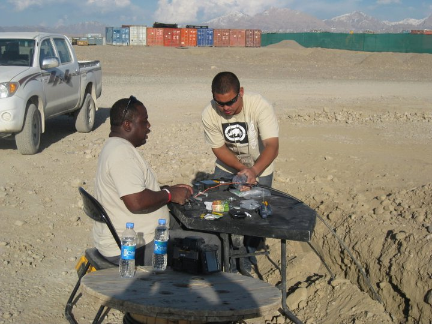
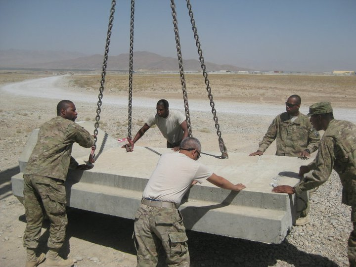

*`Jean Burgos PMP®`*

I took this project on during 2011. The purpose of this project was to complete the delivery of a Technical Control Facility to the Forward Operating Base Shank in the the Logar Provinece of Afghanistan. This project was started before my time. My team consisted of 12 soldiers and over 30 ITT contractors working on the installation of the facility, three Aread Distribution Nodes and a Main Distribution Node. 

As part of our support to the local unit my team also provided helpdesk support responsible for computer repairs, user accounts, network installation and repairs. I also oversaw the Outside Plant Team conducting copper and fiber repairs and additional installations.  

Part of my responsibilities included attending meetings, briefing project and maintenance status, order tools and resources to maintain operations. I was appointed as a Contracting Representative Officer overseing many sub-projects for the completion of the Technical Control Facility. 

As part of the facility and personnel protection my team emplaces T-Walls to protect againts incoming fire. 
[Link](/project5/)